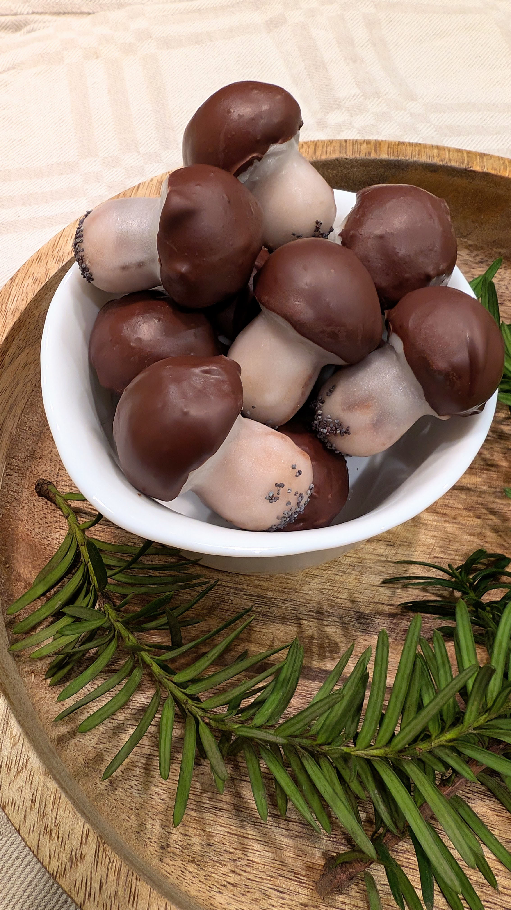

# Biskvitiniai grybukai

Kokia nostalgija! Biskvitiniai grybukai. Minkštutis biskvitas, baltas, traškus kotelis su gaivia citrinų rūgštele ir saldi, juoduoju šokoladu aplieta kepurėlė. 

Kviečiu palepinti save arba paruošti nostalgiškus vaikystės prisiminimus grąžinančią, rankų darbo dovaną savo artimiesiems. 

Garantuoju, kad susižavės ne tik vaikai, bet ir suaugę. :) 

## Jums reikės

* 350 g kvietinių miltų 
* 200 g cukraus
* 130 g augalinio sviesto
* 200 g tirštos augalinės 15% riebumo grietinėlės 
* 2 a.š. vanilinio cukraus 
* 1 a.š. cinamono
* 1 a.š. kepimo miltelių 
* 3/4 puodelio (~200 g) obuolių tyrės

## Baltajam glajui:
* 300 g cukraus pudros
* 2-3 v.š. vandens
* 1 v.š. citrinos sulčių 

## Šokoladiniam glajui:
* 1 šokolado plytelės
* 1 v.š. aliejaus

* Aguonų (grybukų kotelių apačiai)

## Paruošimas

1. Sumaišome inde visus sausus ingredientus.
2. Ištirpiname sviestą ir leidžiame jam šiek tiek atvėsti.
3. Į indą su sausais ingredientais supilama tirpintą augalinį sviestą, dedame obuolių tyrę ir augalinę grietinės alternatyvą. Gerai išmaišome ir paliekame tešlą pastovėti šaldytuve bent 30 min. 
4. Įkaitiname keptuvę su grybukų formelėmis, formeles ištepame aliejumi. Dedame tešlą (tešla turi būti standi, tiršta). Kepame vis apverčiant keptuvę ir grybukus apkepant iš abiejų pusių.
5. Atsargiai išimame grybukus iš keptuvės (grybuko kraštelį užkabinant peiliu ar šakute) ir leidžiame jiems atvėsti. (Jei prie grybukų kraštelių liko papildomos tešlos, ji lengvai nusiims jiems atvėsus)
6. Pasiruošiame baltąjį glaistą ir į jį mirkome grybukų kotelius. Laikydami už grybuko galvutės, kotelio galiuką pamirkome į aguonas. Ir paliekame džiūti.
7. Koteliams išdžiūvus, sukietėjus baltajam glajui, pasiruošiame šokoladinį glaistą. Tirpiname šokolado plytelę ir įmaišome vieną šaukštą aliejaus. Į šokoladinį glajų merkiame grybukų galvutes ir paliekame nudžiūti. 

Skanaus šventinio laukimo!

