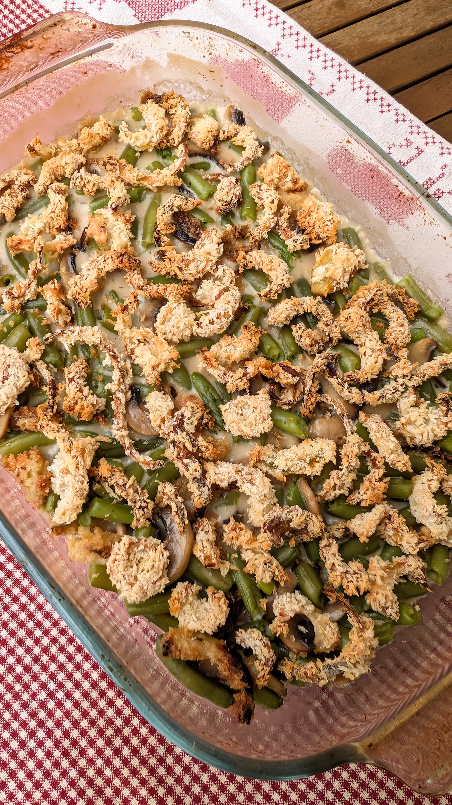

# Troškintos žaliosios pupelės su pievagrybių padažu (Amerikietiškas Green Bean Casserole)

Amerikoje kalėdinis sezonas įsibėgėja dar Lapkritį, iškart po Padėkos dienos (Lapkričio 27 d.). Pagrindines Kalėdų šventines tradicijas puikiai atspindi klasika tapę ir kasmet žiemos laikotarpiu visų žiūrimi Kalėdiniai filmai. :)

Namuose kepami meduoliai ir dekoruojami maistiniais dažais su daug pabarstukų. Puošiamos eglutės ir ant židinių kabinamos Kalėdinės kojinės smulkioms dovanėlėms nuo Santa Klauso sudėti. Įspūdingas namų puošimas su gausybe kalėdinių dekoracijų, milijonu šviečiančių ir mirksinčių lempučių, ir net prakartėlėmis, Santa Klauso ir jo rogių su elniais statulomis kieme. Amerikoje dažnai dekoruojamas net ir namų kaminas, nes tikima, kad pro jį į namus ateina Santa Klausas. Amerikiečiai mėgsta su šeima išeiti pasivaikščioti ar pasivažinėti automobiliu po gyvenvietes ir pasigrožėti namų, ir kiemų dekoracijomis. O tam tikri amerikiečių gyvenamieji kvartalai šiuo laikotarpiu tampa ne tik puošmena sau ir kaimynams, bet ir turistų lankytina vieta su gidų vedamais turais. 

Jungtinėse Amerikos valstijose, nors jau kiek mažiau populiari, bet vis dar gyva ir Kalėdinių giesmių giedojimo tradicija, kai susibūrę į grupeles žmonės eina nuo durų prie durų dainuodami Kalėdines dainas kaimynams.

Santa Klausui vaikai palieka stiklinę pieno su sausainiais ir morkų jo elniams atsidėkojant, kad juos aplankė ir paliko dovanų. Dovanos išpakuojamos Kalėdų rytą. 

Per Kalėdas Amerikoje dažniausiai valgomas kalakutas ar kumpis su spanguolių padažu. O daugelio namuose, tiek per Padėkos dieną, tiek per Kalėdas ypač pupuliarus garnyras - žaliųjų pupelių troškinys su kreminiu grybų padažu, pabarstytas traškiais keptais svogūnais.

## Troškiniui reikės

* 400 g šaldytų žaliųjų, šparaginių pupelių (atitirpintų per naktį šaldytuve)
* 250 g pievagrybių
* 250 ml kokosų pieno
* 0,5 vnt. daržovių sultinio kubelio
* 2 vnt. česnako skiltelių
* Aliejaus kepimui
* 2 v. š. kvietinių miltų
* Žiupsnelio druskos

## Traškiems svogūnams reikės

* 3 vnt. svogūnų
* Kvietinių miltų (~0,5 puodelio)
* Kiaušinio pakaitalo (maišoma tokiu santykiu: 2 v. š. sojos pieno su 2 v. š. kukurūzų krakmolo)
* Panko džiūvėsėlių
* Druskos ir juodųjų pipirų

## Paruošimas

1. Įkaitiname orkaitę iki 220°C temperatūros. Pasiruošiame kepimo skardą padengtą kepimo popieriumi. 
2. Svogūnus perpjauname per pusę ir supjaustome pusžiedžiais (nepjaustykite per daug plonais griežinėliais, nes kepant greitai susvils). Atskiriame kiekvieną svogūno griežinėlį vieną nuo kito. 
3. Pasiruošiame svogūnų kepimui. Į vieną indą įsipilame šiek tiek miltų, į kitą - Panko džiūvėsėlius. Dubenėlyje maišome sojos pieną su kukurūzų krakmolu tokiu santykiu: 2 v. š. sojos pieno prie 2 v. š. kukurūzų krakmolo (Reikalingas mišinio kiekis priklausys nuo jūsų naudojamų svogūnų dydžio, rekomenduoju pradėti pasiruošiant mišinį su 6 v. š. sojos pieno, ir jei bus reikalinga, pasiruošti papildomai mišinio svogūnų ruošimo eigoje). Į mišinį įdedame žiupsnelį druskos ir juodųjų pipirų.
4. Imame žiupsnelį supjaustytų svogūnų ir juos apvoliojame miltuose, tuomet merkiame į pasiruoštą sojos pieno ir kukurūzų krakmolo mišinį, ir tuomet gausiai apvoliojame džiūvėsėliuose. Dedame ant kepimo skardos. Orkaitėje kepame apie 20 min., kol gražiai paruduoja. Kepimui įpusėjus galima šiek tiek pamaišyti, apversti, kad tolygiau apkeptų. 
5. Iškepus svogūnams, juos išimame iš orkaitės, o orkaitės temperatūrą sumažiname iki 200°C.
6. Žaliąsias pupeles apverdame pasūdytame vandenyje, apie 5 min. Tuomet iškart nupilame ir apliejame šaltu vandeniu, vandenį nupilame ir paliekame pastovėti, kol paruošime kitus ingredientus. 
7. Pievagrybius nulupame ir supjaustome griežinėliais. Dedame į keptuvę su šiek tiek aliejaus ir apkepame keletą minučių, kol iš pievagrybių pradeda sunktis skystis. Tuomet įspaudžiame česnako, maišome ir pakepiname dar porą minučių. Beriame miltus (jie sutrauks drėgmę) ir užpilame kokosų pienu. Įdedame druskos ir viską lengvai troškiname ant nedidelės arba vidutinės ugnies, vis pamaišant, kol padažas šiek tiek sutirštėja. Į padažą suverčiame virtas pupeles ir įdedame apie saują orkaitėje keptų, traškių svogūnų.
8. Pasiruošiame kepimo formą. Ją ištepame aliejumi ir sudedame į ją pupeles su grybų padažu. Ant paviršiaus pabarstome keptais, traškiais svogūnais. Kepame orkaitėje apie 15 min.
   
Skanaus ir lengvo pasiruošimo šventėms! :)

