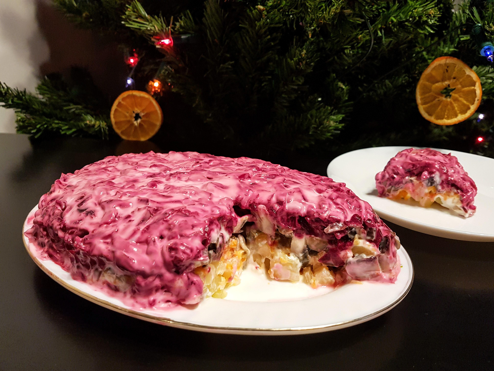

# Ne silkė pataluose

Ar čia tik man Kalėdų ir Naujųjų metų išvakarių stalas sunkiai įsivaizduojamas be silkės pataluose? :D Man šis patiekalas tikra vaikystės švenčių nostalgija, o augalinė šio patiekalo versija nuostabus atradimas. Su svogūnais apkepti pievagrybių griežinėliai sukuria neįtikėtinai į silkės gabalėlius panašią tekstūrą, o jei dar norisi ryškesnio, jūrinio skonio pridėkite konservuotų ar smulkių, džiovintų jūros dublių (nors jie visai nebūtini puikiam skoniui išgauti). Liksite nustebinti! 😊 

## Jums reikės:

* 3 vidutinio dydžio su lupenomis išvirtų bulvių
* 1,5 su lupenomis išvirtos morkos
* Trijų, virtų burokėlių
* Vieno didelio svogūno
* Pievagrybių (~9 vnt.)
* Konservuotų arba džiovintų, smulkintų jūros kopūstų (nebūtina)
* Augalinio majonezo

## Paruošimas:

1. Išverdame burokėlius, morkas ir bulves su lupenomis. Atvėsus, nulupame.
2. Burokėlius ir morkas tarkuojame, o bulves supjaustome kubeliais.
3. Keptuvėje apkepame smulkintą svogūną kartu su griežinėliais supjaustytais pievagrybiais.
4. Lėkštėje sluoksniais dedame ingredientus tokia tvarka: bulvės, morkos, konservuoti jūros kopūstai (jei naudojate džiovintus, rekomenduočiau juos maišyti su keptais pievagrybiais), kepti pievagrybiai, burokėliai. Kiekvieną sluoksnį tepame augaliniu majonezu.

Skanaus šventinio laukimo!

