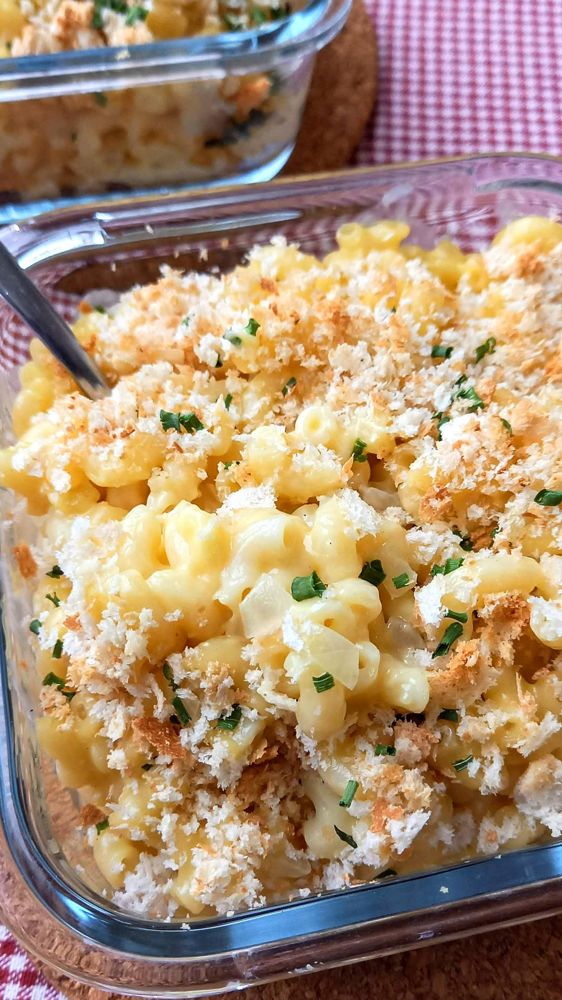

# Makaronai su sūriu (Amerika)

Amerikiečiai per Kalėdas mėgsta pasipuošti "*negražiais*" megztiniais (angl. *ugly sweater*) su juokingais paveiksliukais ar frazėmis, girliandomis ar net su šviečiančiomis lemputėmis. Jaukiai įsitaisę ant sofos su savo šeima žiūrėti legendinius Kalėdinius filmus, tokius kaip "Vienas namuose" arba "Tas nuostabus gyvenimas" (It's a Wonderful Life"), ar specialiai šventiniam sezonui sukurtas Kalėdines laidas rodomas per televiziją. 

Prisimenate Keviną Makalisterį iš filmo "Vienas namuose" ir jo Kūčių vakarienę, ruošiantis apsaugoti savo namus nuo vagišių ir paskubomis mikrobangų krosnelėje šildant pirktinius makaronus su sūriu? "Dieve, palaimink mikrobangę, makaronus su sūriu ir juos pardavinėjančius žmones. Amen." - sukalbėjo maldą Kevinas, bet taip ir nespėjo ramiai pavalgyti.

Makaronai su sūriu iš ties palaimingas, komfortiškas patiekalas, mėgstamas tiek suaugusių, tiek vaikų, tad gal visai ne nuostabu, kad Amerikoje *Mac and cheese* yra vienas iš populiariausių šventinio Kalėdų stalo garnyrų. :) 

Net jei nesusigundysite makaronus su sūriu įtraukti į savo šventinį meniu, būtinai pasilepinkit tokia vakariene žiūrint "Vienas namuose" jaukų žiemos vakarą. :)

## Jums reikės (4 porcijoms)

* 500 g makaronų
* 1 didelio svogūno
* 1 a. š. garstyčių
* 300 g avižų pieno
* 1 v. š. miltų 
* 300 g augalinio sūrio
* Aliejaus kepimui
* Žiupsnio juodųjų pipirų ir druskos

### Džiūvėsėliams

* 4-5 forminės duonos gabalėlių
* 1 v. š. maistinių mielių
* Žiupsnio kepintų česnakų miltelių ir juodųjų pipirų 

## Paruošimo eiga

1. Išverdame makaronus pasūdytame vandenyje.
2. Orkaitę įkaitiname iki 200°C temperatūros.
3. Smulkiai supjaustome svogūną ir apkepame aliejuje, kol suminkštėja ir švelniai paruduoja. 
4. Į keptus svogūnus įdedame šaukštelį garstyčių ir išmaišome. 
5. Įpilame į keptuvę su svogūnais augalinio pieno ir įdedame šaukštą miltų, gerai išmaišome ir užverdame. Leidžiame pavirti porą minučių, kol padažas šiek tiek sutirštėja.
6. Į karštą padažą dedame tarkuotą augalinį sūrį ir maišome, kol augalinis sūris išsilydo. Padažo šiame žingsnyje papildomai kaitinti nereikia.
7. Paruoštą sūrio padažą pilame į virtus makaronus. Išmaišome, kad tolygiai pasiskirstytų. 
8. Duonos riekeles suplėšome mažais gabalėliais ir dedame į virtuvinį mikserį, įdedame maistinių mielių ir sutriname mikseriu iki smulkių, birių trupinių. 
9. Makaronus su augaliniu sūriu dedame į kepimui orkaitėje pritaikytą formą. Makaronų paviršių gausiai pabarstome duonos trupinukais. 
10. Dedame makaronus kepti į orkaitę. Kepame apie 10-15 min 200°C temperatūroje, kol paviršiuje esantys duonos trupinukai švelniai paruduoja. 