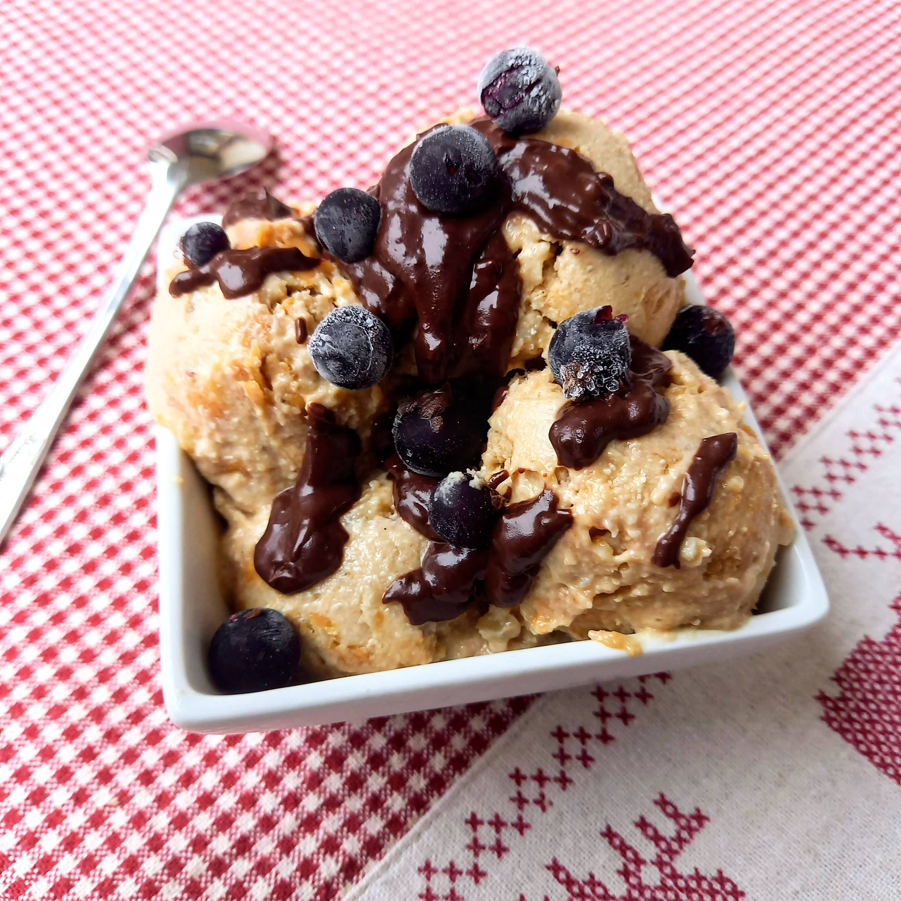

# Naminiai ledai su riešutų sviestu

Kevinas Makalesteris ne kartą visiems įrodė, kad ledais galima mėgautis ne tik vasarą. Tad šį savaitgalį kviečiu leistis į nuotykius Niujorke, o jaukiai filmo peržiūrai pasigaminti skanių ir sveikuoliškų, naminių ledų su riešutų sviestu. Tiesa, su šiuo receptu galite drąsiai eksperimentuoti ir vietoje riešutų sviesto rinktis kitus jums patinkančius priedus: uogas, šokoladą ir kita. Išlaisvinkit savo vaizduotę! 😊 

## Jums reikės

* 290 g anakardžių (išplautų ir mirkytų apie 4 val.)
* 4 prinokusių ir šaldytų bananų
* 1 v.š. kokosų aliejaus
* 1 a.š. vanilės pastos
* Šlakelio šviežiai įspaustų citrinos sulčių (~ 1 a.š.)
* Pusės puodelio sirupo (~140 ml, mes naudojome datulių sirupą)
* Žiupsnelio druskos
* Apie 3 v.š. riešutų sviesto (arba pagal skonį)
* Saujos žemės riešutų be luobelių
* Pagal skonį lydyto šokolado ir šaldytų uogų ledų papuošimui

## Paruošimas

1. 10 min prieš ledų gamybą išsiimame šaldytus bananus iš šaldiklio. Supjaustome gabalėliais.
2. Į trintuvą sudedame mirkytus anakardžius. Užpilame ~115 ml vandens ir trintuvu triname iki vientisos masės.
3. Į trintuvą su anakardžių mase dedame bananus, vanilę, kokosų aliejų, pilame sirupą ir įspaudžiame šlakelį citrinos sulčių, įberiame šiek tiek druskos. Viską sutriname iki vientisos, kreminės tekstūros. (Sutrynus paragaukite ar užtenka saldumo pagal jūsų skonį, turėkite omenyje, kad užšalę ledai jausis ne tokie saldūs).
4. Ledų masę sudedame į indą, kurį galima šaldyti. Ant ledų dedame kelis šaukštus riešutų sviesto ir su šaukštu lengvai permaišome, kad gautųsi margas raštas ir riešutų sviestas netolygiai pasiskirstytų leduose. 
5. Trintuve sutriname iki smulkių gabalėlių žemės riešutus. Ir juos pabarstome ant ledų, jei norisi galima lengvai permaišyti su ledais.
6. Uždengiame ir dedame šaldyti į šaldiklį. Šaldyti reikės bent 4-5 val., kol sustings.
7. Prieš patiekiant ir valgant, ledus išimti 15-25 min iki valgymo, kad šiek tiek atitirptų.
8. Pagal pomėgį serviruojant ledus, užpilame ant viršaus lydyto šokolado, pabarstome šaldytomis uogomis ar riešutais, kokosų drožlėmis.

Skanaus šventinio laukimo!

