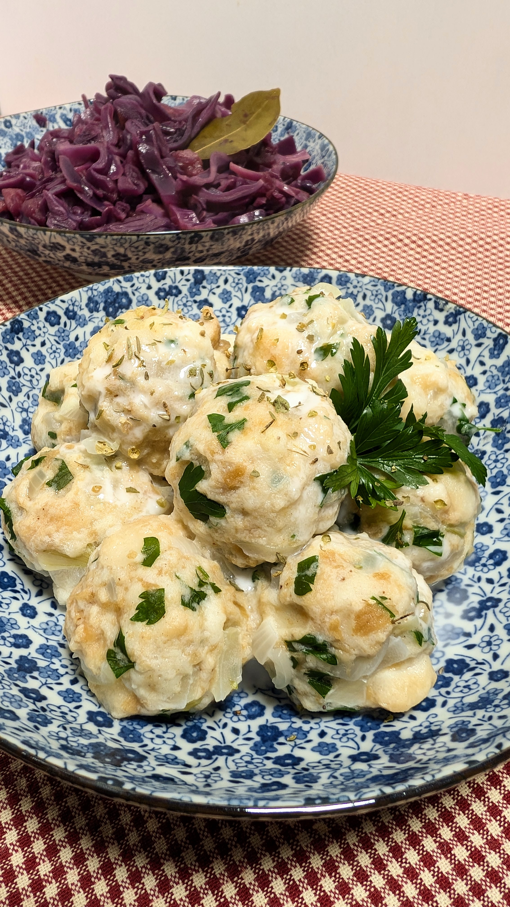

# Vokiški duonos virtinukai

Vokiečių Kalėdinio laikotarpio tradicijos turi daug panašumo su Austrija. Pietinėje Bavarijoje Gruodžio 5 d. taip pat lankosi šiurpusis Krampas - vyrai demoniškais kostiumais, su kailiniais ir ragais žygiuoja gatvėmis ir gali net belstis į namų duris (!!!), kur užsukę pagąsdina vaikus elgtis tinkamai, o padykusius paauglius kartais gali net ištempti į lauką ir išmurkdyti sniege (skamba tikrai kraupiai, nepaisant to, kad įprastai Krampas būna pakviestas pačių tėvų). 

Na, o Gruodžio 6 dienos vokiečių vaikai laukia su didžiausiu nekantrumu ir jau iš vakaro prie savo kambario durų palieka išvalytus batus, kuriuose šventas Nikolas geriems vaikams sudeda dovanėles; įprastai riešutus, saldainius, guminukus ar keletą monetų. 

Kalėdinė eglutė Vokietijoje įprastai puošiama tik per Kūčias. Puošimui naudojami stikliniai, šiaudiniai žaisliukai, saldainiai ar meduoliai, o vietoje mums įprastų lempučių - uždegamos tikros žvakės. Taip pat labai mėgstamos medinių angelų dekoracijos, kuriomis puošiami namai ir Kalėdų eglutės.

Čia ant tradicinio Kalėdinio stalo tikrai pamatysite duonos virtinukus - tai labai mėgstamas garnyras vokiečių ir austrų virtuvėse, kuris gali būti patiekiamas tiek su įvairiais kepsniais, tiek su sriuba ar padažais. Išskirtinė skoninė patirtis. Ragaujant pirmą kartą tikrai būtų sunku atspėti, kad pagaminta tiesiog iš duonos. :) Išbandykite.

## Jums reikės 

* 250 g šviesios duonos
* 200 ml sojos pieno
* 1 vnt. svogūno
* 15-20 g šviežių petražolių
* 1 a. š. druskos
* 0,5 a. š. malto muskato
* Žiupsnelio juodųjų pipirų
* 1 v. š. kukurūzų krakmolo

## Paruošimo eiga

1. Supjaustome duoną nedideliais kubeliais ir įberiame druskos. Išmaišome.
2. Nedideliame puode pašildome, bet neužverdame, sojos pieną. Karštą sojos pieną užpilame ant duonos gabaliukų ir išmaišome, paliekame mirkti.
3. Smulkiais kubeliais papjaustome svogūną ir šviežias petražoles. Svogūną apkepame aliejuje. Į duonos kubelius suverčiame keptus svogūnus ir smulkintas petražoles. Dedame juodųjų pipirų, muskato. 
4. Atskirame nedideliame indelyje sumaišom 1 v. š. kukurūzų kramolo su 3 a. š. vandens. Ir įpilame į duonos mišinį. Viską išmaišome minkydami rankomis. 
5. Puode užverdame vandens. Jį pasūdome ir sumažiname kaitrą, kad vanduo vos vos lengvai virtų (neturi burbuliuoti). 
6. Formuojame rankomis panašaus dydžio duonos virtinukus (kad dydis būtų kuo vienodesnis galima imti su ledų šaukštu) ir dedame į puodą virti. Verdame juos apie 15 min. ant nedidelės kaitros, karštame, bet neburbuliuojančiame vandenyje.
7. Patiekiame su sojos ar kita augaline grietinėle arba apšlaksčius kokosų pienu. Taip pat tinka su grybų padažais. 

