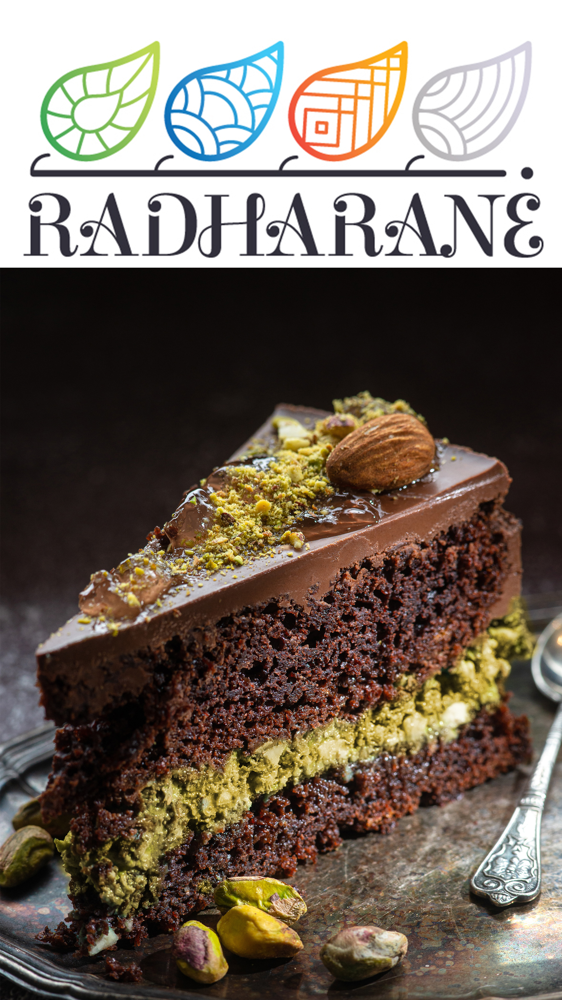

# Dovana nuo restorano "Radharanė"

Šiais metais legendinis, pirmasis Lietuvoje vegetarinis restoranas "Radharanė" turi paruošęs jums išskirtinę dovaną! 

Ištarus slaptažodį “SALDI PASLAPTIS” Vilniaus, Gedimino prospekto "Radharanė" restorane, galėsite pasirinkti vieną iš dviejų ypatingų veganiškų desertų dovanų:
- Pistacijų torto gabalėlį 
ARBA
- Matcha tinginio gabalėlį.

Pasiūlymas galioja iki 2025-01-12 d., vienam asmeniui vieną kartą užsisakius karštą patiekalą arba gėrimą. Pasiūlymas taikomas tik Vilniaus Gedimino prospekto "Radharanė" restorane.

Apsilankykite skanios ir sočios vakarienės, bei nepamirškit pasilepinti desertu. :)

Skanaus!
